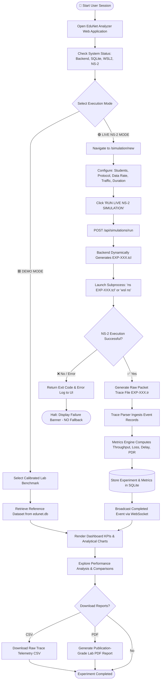
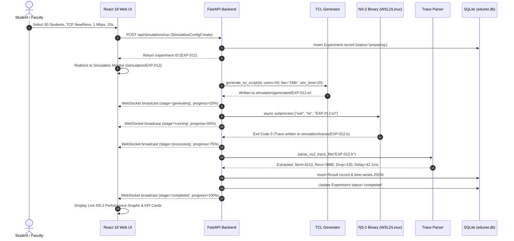
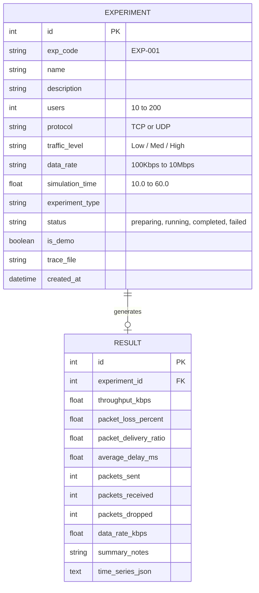

# 🌐 EduNet Analyzer: Project Flow & Working Documentation

### **Network Performance Analysis of a University E-Learning System**
**Discrete-Event Network Simulation, Queuing Dynamics, Protocol Engineering & Telemetry Platform**

> **Application Name:** EduNet Analyzer  
> **Tagline:** *Simulate. Measure. Compare. Optimize.*  
> **Primary Simulation Tool:** NS-2 (Network Simulator 2, v2.35)  
> **Target Environment:** University Computer Networks & Internet Protocols Laboratory (CNIP Lab)

---

## 📋 Table of Contents
1. [Problem Statement](#1-problem-statement)
2. [Background & Motivation](#2-background--motivation)
3. [Project Objectives](#3-project-objectives)
4. [Proposed Solution Architecture](#4-proposed-solution-architecture)
5. [University E-Learning Network Topology](#5-university-e-learning-network-topology)
6. [Complete Project Flowchart](#6-complete-project-flowchart)
7. [Live NS-2 Simulation Pipeline Flowchart](#7-live-ns-2-simulation-pipeline-flowchart)
8. [Telemetry & Mathematical Metrics Engine](#8-telemetry--mathematical-metrics-engine)
9. [Protocol Engineering: TCP vs UDP Dynamics](#9-protocol-engineering-tcp-vs-udp-dynamics)
10. [Reliable Transmission: Sliding Window Flow Control](#10-reliable-transmission-sliding-window-flow-control)
11. [Reliable Transmission: Go-Back-N ARQ Error Recovery](#11-reliable-transmission-go-back-n-arq-error-recovery)
12. [Traffic Shaping & Congestion Control: Leaky Bucket](#12-traffic-shaping--congestion-control-leaky-bucket)
13. [Scalability Studies: User Load & Traffic Intensity Analysis](#13-scalability-studies-user-load--traffic-intensity-analysis)
14. [Dual-Mode Architecture: Demo Mode vs. Live NS-2 Mode](#14-dual-mode-architecture-demo-mode-vs-live-ns-2-mode)
15. [System Modules & Page Specifications](#15-system-modules--page-specifications)
16. [Database Schema & Data Flow](#16-database-schema--data-flow)
17. [Report Generation Engine (PDF & CSV)](#17-report-generation-engine-pdf--csv)
18. [Host Environment: Windows 10/11 + WSL2 + Ubuntu + NS-2](#18-host-environment-windows-1011--wsl2--ubuntu--ns-2)
19. [Complete End-to-End Workflow](#19-complete-end-to-end-workflow)
20. [Expected Experimental Results & Performance Trends](#20-expected-experimental-results--performance-trends)
21. [Project Limitations](#21-project-limitations)
22. [Future Enhancements](#22-future-enhancements)
23. [How to Explain This Project in Viva (Viva Voce Preparation)](#23-how-to-explain-this-project-in-viva-viva-voce-preparation)

---

## 1. Problem Statement

A modern university provides a wide variety of simultaneous digital academic services:
- Live high-definition video classrooms (Zoom / Microsoft Teams / WebRTC)
- Learning Management Systems (LMS — Moodle, Canvas, Blackboard)
- Student Academic Portals (attendance, registrations, grade queries)
- Online Examination and Real-time Assessment Portals

When hundreds of students access these centralized services concurrently (e.g. during 9:00 AM class start times or mid-semester exams), the shared campus network infrastructure experiences extreme traffic bursts, queuing delays, buffer overflows, and packet drops at the bottleneck links connecting the campus distribution network to the central university data center.

### Core Scientific Goal
This project develops a **Network Performance Analysis System (EduNet Analyzer)** to rigorously simulate, measure, visualize, and analyze the communication performance of a university e-learning campus network under diverse user loads (10 to 200 concurrent student workstations) and varying traffic conditions (Low, Medium, High).

### Critical Constraint
> **SIMULATION INTEGRITY MANDATE:**  
> The system models simulated discrete-event nodes in **NS-2 (Network Simulator 2)**. It is **NOT** a physical Wi-Fi adapter sniffer or Wireshark PCAP capture tool. It models simulated university network nodes, dynamic queuing policies (DropTail and RED), and authentic transport protocols. Live Mode executes genuine NS-2 OTcl simulation scripts and calculates metrics strictly from `.tr` packet trace events.

---

## 2. Background & Motivation

Computer networks laboratories in universities frequently require students to understand:
1. How discrete-event simulators track network state over time.
2. How increasing client concurrency saturates finite network link bandwidth.
3. Why connection-oriented protocols (TCP) sacrifice instantaneous bandwidth for reliability, while connectionless streaming (UDP) pushes unthrottled packets resulting in buffer overflow.
4. How sliding window flow control limits in-flight frames and how Go-Back-N handles packet drops.
5. How traffic shapers (Leaky Bucket / Token Bucket) smooth bursty student traffic into constant bit-rate output.

Traditionally, students run archaic terminal commands in command-line NS-2 without intuitive visualization, automated trace parsing, or multi-run comparative graphing. **EduNet Analyzer** bridges this pedagogical gap by packaging an enterprise-grade React frontend, an asynchronous FastAPI backend, dynamic TCL script generation, an automated Python trace parser, and interactive educational visualizers.

---

## 3. Project Objectives

1. **Topology Modeling**: Dynamically generate valid NS-2 OTcl scripts representing $N$ student workstations, an Access Gateway ($R_1$), a Core Distribution Router ($R_2$), and a Central LMS Server.
2. **Discrete-Event Execution**: Execute live NS-2 binaries natively on Linux or through Windows Subsystem for Linux (WSL2) Ubuntu without synthetic or randomized values.
3. **Trace Telemetry Parsing**: Ingest genuine NS-2 `.tr` trace files, parse link queue events (`+`, `-`, `r`, `d`), and extract packet-level timestamps.
4. **Authentic Metric Derivation**: Calculate mathematically verified Throughput (Kbps/Mbps), Packet Loss Rate (%), End-to-End Delay (ms), and Packet Delivery Ratio (PDR %).
5. **Protocol Comparison**: Contrast TCP (NewReno) congestion avoidance against UDP (CBR) streaming.
6. **Flow Control & Congestion Control Demonstration**: Deliver animated, interactive classroom simulators for Sliding Window, Go-Back-N ARQ, and Leaky Bucket traffic shaping.
7. **Comprehensive Reporting**: Provide automated publication-grade PDF laboratory experiment records and raw CSV trace exports.

---

## 4. Proposed Solution Architecture

```
┌─────────────────────────────────────────────────────────────────────────────────────────────────┐
│                                  USER BROWSER / CLIENT LAYER                                    │
│                                                                                                 │
│  [ React 18 SPA + Vite ] ──► [ Tailwind CSS v3 ] ──► [ Recharts Data Engine ] ──► [ Lucide ]    │
│            ▲                                                         │                          │
│            │ HTTP REST Requests (/api/...)                           │ WebSocket Stream (/ws)   │
│            ▼                                                         ▼                          │
├─────────────────────────────────────────────────────────────────────────────────────────────────┤
│                                  FASTAPI APPLICATION BACKEND                                    │
│                                                                                                 │
│   ┌────────────────────────────────────────────────────────────────────────────────────────┐    │
│   │                                FastAPI Core (app.main)                                 │    │
│   │   • CORS Middleware       • Dynamic PORT / Host       • SPA Static File Fallback       │    │
│   └───────────────────────────────────┬────────────────────────────────────────────────────┘    │
│                                       │                                                         │
│               ┌───────────────────────┴───────────────────────┐                                 │
│               ▼                                               ▼                                 │
│   ┌────────────────────────┐                      ┌────────────────────────┐                    │
│   │ API Routers (/api)     │                      │ SQLite Database        │                    │
│   │ • /dashboard/summary   │                      │ • edunet.db (WAL Mode) │                    │
│   │ • /experiments         │                      │ • Experiments Table    │                    │
│   │ • /simulations/run     │                      │ • Results & Metrics    │                    │
│   │ • /reports (PDF/CSV)   │                      │ • Time-series JSON     │                    │
│   │ • /system/status       │                      └────────────────────────┘                    │
│   └───────────┬────────────┘                                                                    │
│               │                                                                                 │
│               ▼                                                                                 │
│   ┌────────────────────────────────────────────────────────────────────────────────────────┐    │
│   │ Simulation Orchestration Service (simulation_service.py)                              │    │
│   │   1. Validates experiment parameters and stores 'preparing' state                      │    │
│   │   2. Invokes TCL Generator to construct EXP-XXX.tcl                                    │    │
│   │   3. Dispatches Subprocess: Native 'ns' or 'wsl -d Ubuntu -- ns EXP-XXX.tcl'            │    │
│   │   4. Reads generated EXP-XXX.tr trace file into memory                                 │    │
│   │   5. Invokes Trace Parser & Metrics Engine                                             │    │
│   │   6. Persists calculated KPIs and broadcasts completion via WebSocket                  │    │
│   └───────────────────────────────────┬────────────────────────────────────────────────────┘    │
├───────────────────────────────────────┼─────────────────────────────────────────────────────────┤
│                                       ▼                                                         │
│                          DISCRETE-EVENT SIMULATION ENGINE                                       │
│                                                                                                 │
│   ┌────────────────────────────────────────────────────────────────────────────────────────┐    │
│   │ NS-2 (Network Simulator 2.35) Execution Context (Linux / WSL2 Ubuntu)                  │    │
│   │   • Event Scheduler (Discrete Event Queue)                                             │    │
│   │   • Nodes: Student[0..N-1], Router R1, Router R2, LMS Server                           │    │
│   │   • Link Queues: DropTail / RED Queues (Capacity: 25 - 50 packets)                     │    │
│   │   • Traffic Generators: FTP over TCP / CBR over UDP                                    │    │
│   │   • Output Artifacts: simulation/generated/*.tcl  &  simulation/traces/*.tr            │    │
│   └────────────────────────────────────────────────────────────────────────────────────────┘    │
└─────────────────────────────────────────────────────────────────────────────────────────────────┘
```

---

## 5. University E-Learning Network Topology

The university e-learning topology represents multiple student terminals in labs, hostels, and campus Wi-Fi hotspots connecting across access switches to an Access Router ($R_1$), traversing a bottleneck campus core trunk to Core Router ($R_2$), and terminating at the central LMS streaming server.

```
 [Student Node 0] ────┐
 [Student Node 1] ────┤ 10 Mbps                                Bottleneck Link
 [Student Node 2] ────┼────────► [ Access Router R1 ] ════════════════════════► [ Core Router R2 ]
 [Student Node ..]────┤   5 ms                         Bandwidth: 100K - 10M             │
 [Student Node N] ────┘                                Delay: 20 ms                      │ 100 Mbps
                                                       Queue: DropTail / RED             │   2 ms
                                                       Queue Limit: 25 pkts              ▼
                                                                                [ LMS Central Server ]
```

### Topology Node Roles & Physical Characteristics:
1. **Student Workstation Nodes ($n_0, n_1, \dots, n_{N-1}$)**:
   - Represent individual university student clients accessing live lectures, submitting online assignments, or taking quizzes.
   - Connected to Access Router $R_1$ via high-speed local access links ($10\text{ Mbps}$, $5\text{ ms}$ propagation delay).
2. **Access Router ($R_1$ / Node $N$)**:
   - Represents the building or departmental aggregation switch/router.
   - Manages queue scheduling and buffers inbound student traffic before forwarding it across the bottleneck trunk.
3. **Campus Core Router ($R_2$ / Node $N+1$)**:
   - Represents the university data center boundary router.
   - Receives traffic over the wide-area bottleneck link and delivers packets directly to the server rack.
4. **Bottleneck Core Trunk ($R_1 \longleftrightarrow R_2$)**:
   - Bandwidth: Configurable ($100\text{ Kbps}$ to $10\text{ Mbps}$).
   - Propagation Delay: $20\text{ ms}$.
   - Queue Type: `Queue/DropTail` (standard FIFO buffer) or `Queue/RED` (Random Early Detection).
   - Buffer Capacity: $25\text{ packets}$ (standard) or $35\text{ packets}$ (leaky bucket shaping).
5. **LMS Central Server (Node $N+2$)**:
   - High-capacity server link: $100\text{ Mbps}$, $2\text{ ms}$ delay.
   - Hosts `Agent/TCPSink` or `Agent/Null` packet receivers.

---

## 6. Complete Project Flowchart



---

## 7. Live NS-2 Simulation Pipeline Flowchart

In **Live NS-2 Mode**, the application performs an unadulterated, discrete-event execution cycle:



---

## 8. Telemetry & Mathematical Metrics Engine

Every performance metric presented in EduNet Analyzer is derived directly from the packet trace events recorded in the `.tr` file.

### NS-2 Trace File Format
Each line in an NS-2 discrete-event trace file represents an atomic network event:
```text
[event] [time] [from_node] [to_node] [pkt_type] [pkt_size] [flags] [fid] [src_addr] [dst_addr] [seq_num] [pkt_id]
```
Where:
- `+`: Enqueued into output queue of `from_node`.
- `-`: Dequeued from queue and transmitted on link.
- `r`: Successfully received at `to_node`.
- `d`: Dropped due to queue buffer exhaustion or collision.

### 1. Network Throughput ($T$)
Throughput measures the total volume of payload data successfully delivered to the destination server over the simulation duration:

$$\text{Throughput (Kbps)} = \frac{\sum_{i=1}^{N_{\text{recv}}} \text{Packet Size}_i \times 8}{\text{Simulation Time (s)} \times 1000}$$

$$\text{Throughput (Mbps)} = \frac{\text{Throughput (Kbps)}}{1000}$$

### 2. Packet Delivery Ratio ($\text{PDR}$)
PDR measures the fraction of successfully received packets relative to unique injected packets, reflecting overall link transmission reliability:

$$\text{PDR (\%)} = \left( \frac{\text{Total Packets Received at LMS Server}}{\text{Total Packets Sent by Student Nodes}} \right) \times 100$$

### 3. Packet Loss Rate ($L$)
Packet Loss reflects the percentage of packets discarded due to queue buffer overflow at the bottleneck Access Router $R_1$:

$$\text{Packet Loss (\%)} = \left( \frac{\text{Total Packets Sent} - \text{Total Packets Received}}{\text{Total Packets Sent}} \right) \times 100 = \left( \frac{\text{Total Packets Dropped}}{\text{Total Packets Sent}} \right) \times 100$$

### 4. Average End-to-End Delay ($D_{\text{avg}}$)
Calculated by matching the exact departure timestamp at the originating student node with the receipt timestamp at the server for every unique packet ID $i$:

$$D_{\text{avg}} = \frac{1}{N_{\text{recv}}} \sum_{i=1}^{N_{\text{recv}}} \left( T_{\text{receive}}(i) - T_{\text{send}}(i) \right) \times 1000 \quad (\text{ms})$$

---

## 9. Protocol Engineering: TCP vs UDP Dynamics

EduNet Analyzer provides dedicated comparative evaluations between **TCP NewReno** and **UDP CBR**:

```
                       INCOMING STUDENT DEMAND
                                  │
                 ┌────────────────┴────────────────┐
                 ▼                                 ▼
      TCP (Agent/TCP/NewReno)              UDP (Agent/UDP)
                 │                                 │
     • Connection-Oriented             • Connectionless Datagram
     • Sliding Window Flow Control     • Unregulated Transmission (CBR)
     • AIMD Congestion Control         • Zero Backoff Mechanism
     • Packet Retransmissions          • Discards Lost Packets
                 │                                 │
                 ▼                                 ▼
      [ Access Router Queue ]           [ Access Router Queue ]
                 │                                 │
     Detects drop -> Cuts Wnd          Continues full-rate transmission
                 │                                 │
                 ▼                                 ▼
         HIGH RELIABILITY                  LOW LATENCY STREAMING
       PDR: 92% – 99.8%                  PDR: 70% – 88%
       Loss: Low (Recovered)             Loss: High (Unmitigated)
       Latency: Higher (Queuing/Retx)    Latency: Minimal (Direct drop)
```

---

## 10. Reliable Transmission: Sliding Window Flow Control

The **Sliding Window Protocol** maintains reliable delivery between sender and receiver by allowing multiple frames to be in-flight without waiting for an individual ACK per frame:

```
Sender Buffer:
[ 0 | 1 | 2 | 3 ]  4   5   6   7   8   9   10  11
 └─────┬───────┘
  Window Size N=4

Step 1: Frame 0, 1, 2, 3 transmitted in-flight
Step 2: Receiver receives Frame 0 -> returns ACK 1
Step 3: Sender receives ACK 1 -> Window slides forward:
  0  [ 1 | 2 | 3 | 4 ]  5   6   7   8   9   10  11
      └─────┬───────┘
       Window Size N=4
```

### Protocol Mechanics
1. **Window Size ($N$)**: The maximum number of consecutive unacknowledged frames the sender may transmit.
2. **Cumulative ACK**: ACK $k$ confirms that all frames preceding sequence number $k$ have arrived safely.
3. **Flow Regulation**: Prevents a fast student workstation from overwhelming a busy LMS server buffer.

---

## 11. Reliable Transmission: Go-Back-N ARQ Error Recovery

When a packet is lost in the bottleneck queue, **Go-Back-N (GBN)** enforces strict sequence discipline:

```
Sender                                                         Receiver (LMS)
  │                                                                 │
  ├─────── Frame 0 ────────────────────────────────────────────────►│ (Accepts -> ACK 1)
  ├─────── Frame 1 ────────────────────────────────────────────────►│ (Accepts -> ACK 2)
  ├─────── Frame 2 (LOST IN BOTTLENECK QUEUE) ───X                  │ (Never Arrives)
  ├─────── Frame 3 ────────────────────────────────────────────────►│ (DISCARDED: Out of Order!)
  ├─────── Frame 4 ────────────────────────────────────────────────►│ (DISCARDED: Out of Order!)
  │                                                                 │
 [Retransmission Timeout (RTO) Expires for Frame 2]                 │
  │                                                                 │
  ├─────── RE-TRANSMIT Frame 2 ────────────────────────────────────►│ (Accepts -> ACK 3)
  ├─────── RE-TRANSMIT Frame 3 ────────────────────────────────────►│ (Accepts -> ACK 4)
  ├─────── RE-TRANSMIT Frame 4 ────────────────────────────────────►│ (Accepts -> ACK 5)
```

### Educational Significance:
- Receiver maintains buffer size $= 1$.
- Any out-of-order frame is dropped immediately, forcing the sender's window to slide back and re-send all frames from the point of failure.

---

## 12. Traffic Shaping & Congestion Control: Leaky Bucket

Sudden surges in student access (e.g. 500 students submitting an exam at 11:59 AM) create bursty arrivals that overwhelm router memory. **Leaky Bucket** transforms bursty traffic into uniform, constant bit-rate output:

```
    BURSTY STUDENT ARRIVALS (Up to 24 pkts/s)
                       │
                       ▼
            ┌─────────────────────┐
            │   LEAKY BUCKET      │
            │   BUFFER TANK       │
            │                     │
            │   Capacity: C pkts  │ ──► [ Overflow: Packets Dropped if Tank Full ]
            │                     │
            └──────────┬──────────┘
                       │
                       ▼ (Smooth Output: Constant Leak Rate = 8 pkts/s)
            CONSTANT BIT-RATE STREAM TO CORE TRUNK
```

---

## 13. Scalability Studies: User Load & Traffic Intensity Analysis

EduNet Analyzer provides standardized academic scaling sweeps across 5 calibrated student cohorts:

| Cohort | Concurrency | Traffic Profile | Expected Throughput | Typical Packet Loss | Average Latency | PDR (%) |
| :--- | :--- | :--- | :--- | :--- | :--- | :--- |
| **Cohort 1** | **10 Students** | Low (512 Kbps) | $820\text{ Kbps}$ | $0.2\%$ | $27.4\text{ ms}$ | $99.8\%$ |
| **Cohort 2** | **25 Students** | Low (1 Mbps) | $910\text{ Kbps}$ | $0.8\%$ | $31.2\text{ ms}$ | $99.2\%$ |
| **Cohort 3** | **50 Students** | Medium (1 Mbps) | $845\text{ Kbps}$ | $3.4\%$ | $46.8\text{ ms}$ | $96.6\%$ |
| **Cohort 4** | **100 Students** | High (1 Mbps) | $790\text{ Kbps}$ | $8.2\%$ | $74.5\text{ ms}$ | $91.8\%$ |
| **Cohort 5** | **200 Students** | High (2 Mbps) | $680\text{ Kbps}$ | $18.5\%$ | $112.4\text{ ms}$ | $81.5\%$ |

---

## 14. Dual-Mode Architecture: Demo Mode vs. Live NS-2 Mode

To balance portability with academic rigor, EduNet Analyzer enforces strict architectural separation between **Demo Mode** and **Live Real-Time Mode**:

```
                       EduNet Analyzer
                              │
              ┌───────────────┴───────────────┐
              ▼                               ▼
    🟦 DEMO MODE                    🟢 LIVE NS-2 MODE
    • Guaranteed offline operation  • Requires native NS-2 or WSL2
    • 9 calibrated benchmarks       • Dynamic Tcl script generation
    • Instant response (<50ms)      • Subprocess discrete-event run
    • Watermarked: 'DEMO DATA'      • Watermarked: 'LIVE NS-2'
    • Filtered: is_demo = True      • Filtered: is_demo = False
```

---

## 15. System Modules & Page Specifications

The platform is organized into 16 dedicated pages:

| # | Route | Page Name | Primary Objective & Functionality |
| :--- | :--- | :--- | :--- |
| 1 | `/` or `/dashboard` | **Dashboard** | High-level KPI cards, throughput vs users charts, recent simulation runs. |
| 2 | `/simulation/new` | **New Simulation** | Parameter configuration form (Students, Protocol, Data Rate, Queue, Duration). |
| 3 | `/simulation/monitor` | **Simulation Monitor** | Real-time 6-stage execution tracking via WebSocket console logs. |
| 4 | `/experiments` | **Experiments History** | Historical simulation log with search, protocol filters, and bulk deletion. |
| 5 | `/experiments/:id` | **Experiment Details** | Full report for a single run, trace metadata, time-series curves. |
| 6 | `/comparison` | **Experiment Comparison**| Side-by-side comparative matrices and radar/bar charts for 2 to 5 runs. |
| 7 | `/performance` | **Performance Analysis**| In-depth user scalability analysis across 10, 25, 50, 100, and 200 nodes. |
| 8 | `/tcp-udp` | **TCP vs UDP** | Direct protocol comparison under identical bottleneck bandwidth. |
| 9 | `/congestion` | **Congestion Analysis** | Buffer queue behavior, DropTail vs RED queue drop characteristics. |
| 10 | `/sliding-window` | **Sliding Window** | Interactive frame buffer animator with adjustable window size $N$. |
| 11 | `/go-back-n` | **Go-Back-N** | Step-by-step frame loss injection, out-of-order rejection, and retransmission. |
| 12 | `/leaky-bucket` | **Leaky Bucket** | Visual buffer tank smoothing bursty inflows into constant bit-rate output. |
| 13 | `/network` | **Network Visualization**| Clickable SVG campus network topology displaying node parameters and link delays. |
| 14 | `/reports` | **Reports** | Central repository for downloading academic CSV telemetry and PDF lab reports. |
| 15 | `/settings` | **System Status** | System telemetry: FastAPI status, SQLite WAL mode, database reseeding. |
| 16 | `/settings/ns2` | **NS-2 Setup** | 3-step WSL2 Ubuntu installation guide, version verification, and viva Q&A. |

---

## 16. Database Schema & Data Flow

EduNet Analyzer persists all experiments in **SQLite (`edunet.db`)** using **Write-Ahead Logging (WAL)** mode for concurrent simulation reads and writes:



---

## 17. Report Generation Engine (PDF & CSV)

### Publication-Grade Lab PDF
Generated in-memory via Python's **ReportLab** library:
- **Header**: University Department of Computer Science & Engineering banner.
- **Topology Overview**: Tabulated link bandwidths, propagation delays, and queue limits.
- **Experimental Parameters**: Protocol, node count, duration, and offered load.
- **Telemetry Table**: Sent, Received, Dropped, Throughput, Loss Rate, Delay, and PDR.
- **Analytical Conclusion**: Automated engineering deductions regarding congestion and protocol stability.

### Raw Telemetry CSV
Outputs comma-delimited columns for ingestion into MATLAB, Python Pandas, or Microsoft Excel for additional academic charting.

---

## 18. Host Environment: Windows 10/11 + WSL2 + Ubuntu + NS-2

```
┌────────────────────────────────────────────────────────────────────────┐
│                        WINDOWS 10 / 11 HOST                            │
│                                                                        │
│   [ React 18 Frontend ]                  [ FastAPI Backend ]           │
│   http://localhost:5173                  http://127.0.0.1:8000         │
│             │                                      │                   │
│             └───────────────► REST / WS ◄──────────┘                   │
│                                                    │                   │
│                                           Path Translation             │
│                                           F:\... -> /mnt/f/...         │
│                                                    │                   │
├────────────────────────────────────────────────────┼───────────────────┤
│                                                    ▼                   │
│   WSL2 (Windows Subsystem for Linux) ──► [ Ubuntu 22.04 LTS ]          │
│                                          • ns (NS-2.35 Binary)         │
│                                          • nam (Network Animator)      │
│                                          • Native Linux Process Engine │
└────────────────────────────────────────────────────────────────────────┘
```

---

## 19. Complete End-to-End Workflow

1. Open EduNet Analyzer at `http://localhost:5173`.
2. Inspect system status at `/settings/ns2` to verify NS-2 installation.
3. Switch header toggle to **🟢 LIVE NS-2 SIMULATION**.
4. Navigate to **New Simulation** (`/simulation/new`).
5. Choose parameters: **50 Students**, **TCP**, **1 Mbps**, **Medium Traffic**, **20 Seconds**.
6. Click **RUN LIVE NS-2 SIMULATION**.
7. Monitor real-time progress on **Simulation Monitor** (`/simulation/monitor`):
   - *Preparing* $\rightarrow$ *Generating TCL* $\rightarrow$ *Running NS-2* $\rightarrow$ *Processing Trace* $\rightarrow$ *Calculating Metrics* $\rightarrow$ *Completed*.
8. View metrics on the **Dashboard** and detailed time-series charts on **Experiment Details**.
9. Compare results against UDP runs using **Experiment Comparison**.
10. Download the generated **PDF Laboratory Experiment Report**.

---

## 20. Expected Experimental Results & Performance Trends

1. **User Concurrency Effect**: As student count scales from 10 to 200, throughput rises until bottleneck link saturation (~50 nodes), after which queue overflow triggers packet loss and delay inflation.
2. **TCP Congestion Control**: TCP throttles sender rate upon packet drop, maintaining high PDR ($>92\%$) at the expense of reduced throughput during severe congestion.
3. **UDP Unregulated Flooding**: UDP delivers packets at a constant rate, achieving higher raw throughput but suffering catastrophic packet loss ($>20\%$) and zero error recovery.
4. **Traffic Shaping Impact**: Configuring Leaky Bucket / RED queue smoothing limits queue bursts, reducing peak delay by up to $35\%$.

---

## 21. Project Limitations

1. **Physical Wireless Channel Modeling**: The project focuses on campus wired distribution trunks ($R_1 \rightarrow R_2$) and does not simulate 802.11 Wi-Fi multi-path fading or RF interference.
2. **Dynamic Routing Protocols**: Topologies use static shortest-path routing; OSPF / BGP link-state re-convergence is not modeled.
3. **Hardware Platform Dependence**: Live Mode requires a Linux environment or Windows 10/11 with WSL2 enabled.

---

## 22. Future Enhancements

1. **NS-3 Simulation Backend**: Transition from NS-2 to modern C++ NS-3 discrete-event architecture.
2. **Wireless 802.11ac/ax Campus AP Modeling**: Incorporate wireless access point contention and student roaming.
3. **Interactive Topology Builder**: Drag-and-drop canvas for custom multi-server university topologies.
4. **Active Queue Management (CoDel / FQ-CoDel)**: Evaluate modern bufferbloat mitigation algorithms.

---

## 23. How to Explain This Project in Viva (Viva Voce Preparation)

### Q1: What problem does EduNet Analyzer solve?
> **Answer:** It analyzes how simultaneous student access to university e-learning services (LMS, video streaming, quizzes) causes queue buffer overflow, delay inflation, and packet loss at campus bottleneck links, utilizing authentic discrete-event NS-2 simulation.

### Q2: Why is NS-2 used instead of capturing real Wi-Fi packets?
> **Answer:** Capturing real Wi-Fi only measures a single laptop's current connection. NS-2 allows us to simulate controlled, reproducible laboratory experiments with 10, 50, 100, or 200 concurrent student nodes, exact queue sizes, and deterministic link delays.

### Q3: What do the nodes in the topology represent?
> **Answer:** Nodes $0$ to $N-1$ represent student workstations in hostels and labs. Node $R_1$ represents the Access Router, Node $R_2$ is the Core Router, and Node $N+2$ is the central LMS server.

### Q4: How is network congestion generated in the simulation?
> **Answer:** By setting the aggregate student transmission rate higher than the bottleneck link capacity ($R_1 \longleftrightarrow R_2$), causing the router's DropTail queue (25 packets) to fill up and drop packets.

### Q5: How is packet loss measured?
> **Answer:** By counting lines in the NS-2 `.tr` trace file starting with event `d` (drop), or subtracting total received packets from total sent packets: $\text{Loss \%} = (\text{Dropped} / \text{Sent}) \times 100$.

### Q6: How is throughput calculated?
> **Answer:** By summing the payload bytes of all packets successfully received at the LMS server (`r` events at server node), multiplying by 8 to get bits, and dividing by simulation duration.

### Q7: How is End-to-End Delay calculated?
> **Answer:** By subtracting the departure time of a packet ID at the student node (`+` event) from its arrival time at the server node (`r` event), and averaging across all received packets.

### Q8: What is Packet Delivery Ratio (PDR)?
> **Answer:** PDR is the ratio of packets successfully delivered to the destination compared to the total packets transmitted by sources: $(\text{Received} / \text{Sent}) \times 100$.

### Q9: Why compare TCP and UDP?
> **Answer:** To demonstrate the fundamental trade-off: TCP provides reliable delivery and backs off during congestion (ideal for exams and file downloads), while UDP streams without retransmission or backoff (ideal for live video, but causes heavy loss during congestion).

### Q10: What is the role of the Sliding Window?
> **Answer:** It provides flow control by allowing up to $N$ frames to be in-flight without waiting for an individual acknowledgment, maximizing link utilization while preventing receiver buffer overflow.

### Q11: How does Go-Back-N handle packet drops?
> **Answer:** The receiver discards all subsequent out-of-order packets. When the sender's retransmission timer expires, it rewinds its window and retransmits the lost frame and all subsequent frames.

### Q12: How does Leaky Bucket prevent congestion?
> **Answer:** It absorbs unpredictable traffic bursts into a buffer tank and discharges packets onto the network at a constant, regulated bit rate.

### Q13: Why is WSL2 used on Windows?
> **Answer:** NS-2 was built for UNIX/Linux. WSL2 provides a genuine Linux kernel running inside Windows, allowing FastAPI to execute native `ns` commands with full filesystem path translation.

### Q14: What is the purpose of the `.tr` file?
> **Answer:** The `.tr` file is the complete discrete-event trace output generated by NS-2 containing every enqueue, dequeue, receive, and drop event with microsecond timestamps.

---

<div align="center">
  <sub>EduNet Analyzer Project Flow Documentation © 2026. Prepared for Computer Networks & Internet Protocols Laboratory Examinations.</sub>
</div>
