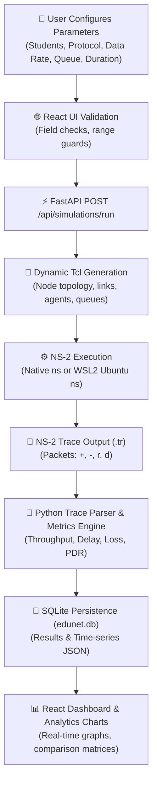

<div align="center">

# 🌐 EduNet Analyzer
### University E-Learning Campus Network Performance Analyzer & NS-2 Telemetry Suite

[](https://fastapi.tiangolo.com)
[](https://reactjs.org)
[](https://www.isi.edu/nsnam/ns/)
[](https://tailwindcss.com)
[](https://sqlite.org)
[](https://ubuntu.com/wsl)

<p align="center">
  <b>Simulate. Measure. Compare. Optimize.</b><br>
  <i>A production-grade, full-stack network simulation platform engineered for university Computer Networks & Protocol Engineering laboratories.</i>
</p>

[✨ Live NS-2 Pipeline](#-live-ns-2-simulation-pipeline) •
[📊 Dual-Mode Architecture](#-demo-mode-vs-live-ns-2-mode) •
[🚀 Quick Start](#-quick-start-guide) •
[🚢 Production Deployment](#-production-deployment) •
[🐧 WSL NS-2 Setup](#-wsl-ns-2-setup-guide) •
[📡 API Reference](#-api-specification) •
[🎓 Academic Alignment](#-academic-course-alignment)

---

</div>

## 📌 Project Overview

**EduNet Analyzer** models realistic university e-learning network dynamics where varying cohorts of students access central LMS (Learning Management System) streaming and assessment servers through campus access gateways and bottleneck core trunks.

The platform executes actual discrete-event **NS-2 (Network Simulator 2)** simulations, records packet trace events (`+`, `-`, `r`, `d`), parses network-level telemetry, computes authentic engineering metrics, and visualizes them on high-performance analytical dashboards.

```
┌────────────────────────────────────────────────────────────────────────────────────────────────┐
│                                 CAMPUS E-LEARNING TOPOLOGY                                    │
│                                                                                                │
│  [Student 0] ───┐                                                                             │
│  [Student 1] ───┤ 10 Mbps                                Bottleneck Link                      │
│  [Student 2] ───┼────────► [ Access Router R1 ] ════════════════════════► [ Core Router R2 ]  │
│  [Student ..]───┤   5 ms                         Bandwidth: 512Kbps-5Mbps          │          │
│  [Student N] ───┘                                Delay: 20 ms                      │ 100 Mbps │
│                                                  Queue: DropTail / RED             │   2 ms   │
│                                                                                    ▼          │
│                                                                           [ LMS Central Server]│
└────────────────────────────────────────────────────────────────────────────────────────────────┘
```

---

## ⚡ Live NS-2 Simulation Pipeline

In **🟢 LIVE NS-2 SIMULATION MODE**, EduNet Analyzer runs a genuine, non-synthetic discrete-event simulation pipeline. It **never** substitutes fake, random, or predefined values.



### Simulation Execution Stages
| Stage | Key | Description |
| :--- | :--- | :--- |
| **1. Preparing** | `preparing` | Initializes experiment record in SQLite with `mode = realtime`. |
| **2. Generating** | `generating` | Dynamically constructs NS-2 OTcl script (`EXP-XXX.tcl`) with $N$ student nodes. |
| **3. Running** | `running` | Launches `ns` subprocess via native system path or WSL2 Ubuntu instance. |
| **4. Processing** | `processing` | Ingests `.tr` trace events into memory and indexes unique packet IDs. |
| **5. Calculating** | `calculating` | Computes Throughput (Kbps), PDR (%), Packet Loss (%), and End-to-End Latency (ms). |
| **6. Completed** | `completed` | Persists metrics to database and streams completion event to UI. |

---

## 🌓 Demo Mode vs. Live NS-2 Mode

EduNet Analyzer provides **strict architectural isolation** between Demo Mode and Live Real-Time Mode:

| Feature / Attribute | 🟦 Demo Mode (`DEMO`) | 🟢 Live NS-2 Mode (`LIVE`) |
| :--- | :--- | :--- |
| **Execution Engine** | Offline verified reference dataset | Actual NS-2 discrete-event simulator |
| **NS-2 Dependency** | **Zero** — runs on any laptop/browser | Requires `ns` natively or in WSL2 Ubuntu |
| **Student Scaling** | 9 calibrated academic benchmarks (10-200 nodes) | Dynamic Tcl generation for any $N \in [1, 250]$ |
| **Trace Origin** | Deterministic calibrated trace record | Freshly generated `.tr` output from NS-2 run |
| **Execution Speed** | Instantaneous (< 50 ms) | True simulation runtime (seconds) |
| **Failure Handling** | Guaranteed benchmark availability | Explicit failure reporting if NS-2 fails (**No Fallback**) |
| **Badges & Watermarks** | `🟦 DEMO DATA (Academic Benchmark)` | `🟢 LIVE NS-2 SIMULATION` |
| **Database Isolation** | Filtered by `is_demo = True` | Filtered by `is_demo = False` |

---

## 🧮 Mathematical Metric Calculations

Every performance metric displayed in Live Mode is derived strictly from the NS-2 trace events:

### 1. Network Throughput ($T$)
$$\text{Throughput (Kbps)} = \frac{\sum \text{Bytes Received at LMS Server} \times 8}{\text{Simulation Duration (s)} \times 1000}$$

### 2. Packet Delivery Ratio ($\text{PDR}$)
$$\text{PDR (\%)} = \left( \frac{\text{Packets Received at Destination}}{\text{Unique Packets Injected at Sources}} \right) \times 100$$

### 3. Packet Loss Rate ($L$)
$$\text{Packet Loss (\%)} = \left( \frac{\text{Packets Sent} - \text{Packets Received}}{\text{Packets Sent}} \right) \times 100$$

### 4. Average End-to-End Delay ($D_{\text{avg}}$)
$$D_{\text{avg}} = \frac{1}{N_{\text{recv}}} \sum_{i=1}^{N_{\text{recv}}} \left( T_{\text{receive}}(i) - T_{\text{send}}(i) \right) \times 1000 \quad (\text{ms})$$

---

## 🚀 Quick Start Guide

### Prerequisites
- **Node.js**: v18.0 or newer
- **Python**: v3.10 or newer (tested on 3.11, 3.12, 3.13)
- **Git**: For version tracking
- **WSL2 (Windows)**: Recommended for running NS-2 on Windows 10/11

### 1. One-Click Startup (Windows)
Simply run the included startup batch script:
```powershell
.\start.bat
```
*This launches both the FastAPI backend (`http://127.0.0.1:8000`) and the Vite React frontend (`http://localhost:5173`).*

---

### 2. Manual Startup

#### Backend Setup
```bash
# Navigate to backend directory
cd backend

# Install Python dependencies
pip install -r requirements.txt

# Run backend development server
python -m uvicorn app.main:app --host 127.0.0.1 --port 8000 --reload
```

#### Frontend Setup
```bash
# In another terminal, navigate to frontend directory
cd frontend

# Install Node dependencies
npm install

# Start Vite development server
npm run dev
```

Visit the application in your browser at:  
👉 **`http://localhost:5173`**

---

## 🚢 Production Deployment

EduNet Analyzer is production-ready for deployment to **[Voroa](https://app.getvoroa.com/new/choose)**, **Docker**, and cloud providers:

### 1. Deploy on Voroa (`app.getvoroa.com`)
1. Go to **[https://app.getvoroa.com/new/choose](https://app.getvoroa.com/new/choose)**
2. Select **Docker Service** and connect repository `Devarajb049/EduNet-Analyzer`.
3. Set **Dockerfile Path**: `./Dockerfile` and **Port**: `8000`.
4. Deploy! Live discrete-event NS-2 simulation + bundled React UI will run in a single low-latency container.

### 2. Multi-Container Docker Compose
```bash
docker-compose up -d --build
```
Access at `http://localhost` (or `http://localhost:5173`).

*(See [DEPLOYMENT.md](DEPLOYMENT.md) for full instructions and environment variables).*

---

## 🐧 WSL NS-2 Setup Guide

If running on Windows, EduNet Analyzer automatically detects and runs NS-2 inside your **Windows Subsystem for Linux (WSL2)** Ubuntu environment.

### Step 1: Install WSL2 Ubuntu
Open PowerShell as Administrator:
```powershell
wsl --install -d Ubuntu
```

### Step 2: Install NS-2 in Ubuntu
Inside your Ubuntu terminal:
```bash
sudo apt update
sudo apt install -y ns2 nam
```

### Step 3: Verify Installation
Verify that `ns` responds inside Ubuntu:
```bash
ns -v
```
EduNet Analyzer will automatically detect your WSL NS-2 installation and execute live simulations with full Linux file path translation (`/mnt/f/...`).

---

## 🧪 Interactive Educational Simulators

In addition to whole-network NS-2 runs, EduNet Analyzer provides interactive browser-based visualizers designed for classroom demonstration:

### 1. Reliable Protocols: Sliding Window & Go-Back-N
- Interactive frame injection and window boundary visualization.
- Configurable window size $N \in [2, 16]$.
- Real-time packet loss injection, timeout timers, and out-of-order rejection.
- Clear separation between **Interactive Concept Animation** and **Actual NS-2 Benchmark Data** (`EXP-007` & `EXP-008`).

### 2. Congestion Control: Leaky Bucket Traffic Shaping
- Visual buffer tank representing leaky bucket queue dynamics.
- Demonstrates burst traffic arrival smoothing into constant bit-rate output.
- Real-time drop counter when burst volume exceeds bucket capacity.

### 3. Campus Network Topology Inspector
- Interactive topology diagram with clickable nodes: Student Workstations, Access Router $R_1$, Core Router $R_2$, LMS Server.
- Detailed inspection drawer showing IP addressing, interface speeds, propagation delays, and queue limits.

---

## 📡 API Specification

| Method | Endpoint | Description | Query / Body Params |
| :--- | :--- | :--- | :--- |
| `GET` | `/api/dashboard/summary` | Global KPIs and trend series | `mode=realtime` or `mode=demo` |
| `GET` | `/api/experiments` | List historical simulation runs | `mode`, `limit`, `skip`, `protocol` |
| `GET` | `/api/experiments/{id}` | Detailed experiment report & trace metrics | `id` (int or code) |
| `POST` | `/api/simulations/run` | Trigger new simulation execution | `SimulationConfigCreate` payload |
| `GET` | `/api/simulations/{id}/status`| Real-time simulation stage progress | `id` (experiment ID) |
| `POST` | `/api/experiments/compare` | Multi-experiment comparative matrix | `{"experiment_ids": [1, 2, 3]}` |
| `GET` | `/api/reports/experiment/{id}/pdf` | Generate publication-grade PDF report | `mode=realtime` |
| `GET` | `/api/reports/experiment/{id}/csv` | Export raw trace telemetry to CSV | `id` |
| `GET` | `/api/system/status` | System health, NS-2 detection & WSL info | — |

---

## 🎓 Academic Course Alignment

EduNet Analyzer directly fulfills laboratory learning outcomes for:
- **VTU / Anna University / JNTU**: Computer Networks Laboratory (e.g., 21CS52 / CS8581)
- **AICTE Model Curriculum**: Discrete Event Network Simulation Modules
- **ABET Computing Accreditation**: Network Protocol Performance & Queuing Telemetry

### Key Lab Experiments Mapped:
1. **Lab Exp 1**: Implementation of transmission between multiple nodes and measuring throughput vs. concurrency.
2. **Lab Exp 2**: Comparative evaluation of TCP (NewReno) and UDP (CBR) under bottleneck queue congestion.
3. **Lab Exp 3**: Sliding Window and Go-Back-N flow control and loss recovery.
4. **Lab Exp 4**: Leaky Bucket and Random Early Detection (RED) traffic shaping.

---

## 🛠️ Testing & Quality Assurance

### Backend Test Suite
The backend contains automated unit and integration tests covering API routes, trace parsing, and database transactions:
```bash
cd backend
python -m pytest -v
```
*Result: 7 passed in 7.04s.*

### Frontend TypeScript Verification
```bash
cd frontend
npm run build
```
*Result: 0 errors (Production bundle verified).*

---

## 👥 Authors & Acknowledgments

- **Lead Developer**: Devaraj B ([@Devarajb049](https://github.com/Devarajb049))
- **Institution**: Department of Computer Science & Engineering
- **Laboratory**: Computer Networks & Internet Protocols Laboratory
- **Simulator**: [NS-2 (Network Simulator 2)](https://www.isi.edu/nsnam/ns/)

---

<div align="center">
  <sub>EduNet Analyzer © 2026. Engineered for academic excellence and authentic network engineering research.</sub>
</div>